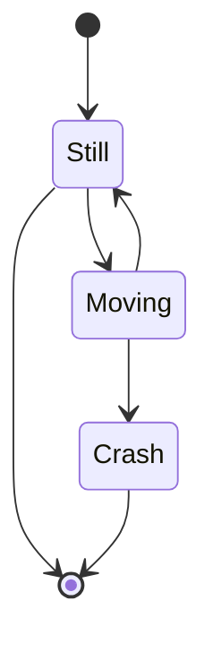

[State diagrams | Mermaid](https://mermaid.js.org/syntax/stateDiagram.html)

```mermaid
stateDiagram-v2
    [*] --> Still
    Still --> [*]
    Still --> Moving
    Moving --> Still
    Moving --> Crash
    Crash --> [*]
```
